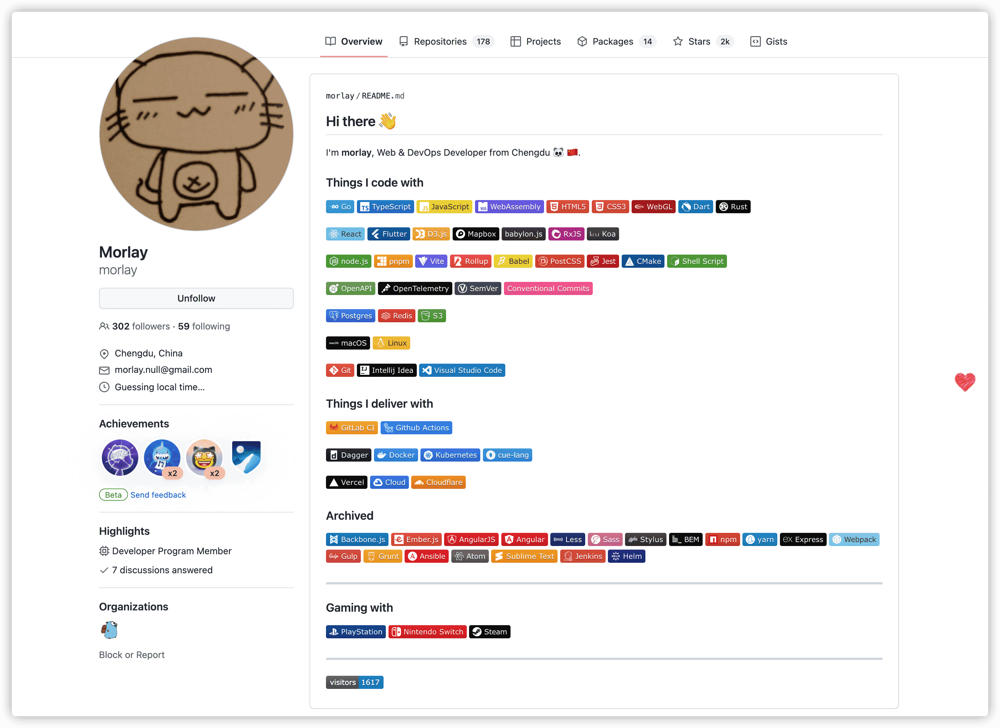
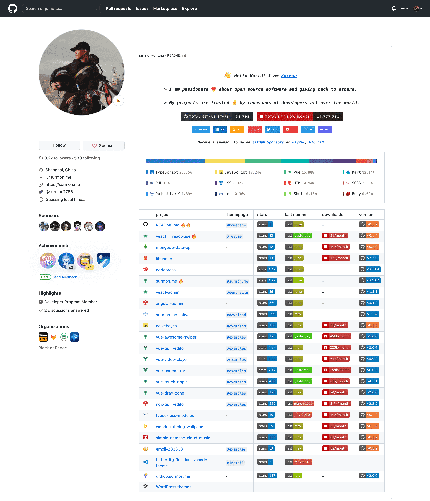

<h1>awesome github profile readme chinese</h1>

 🦩 中文区优秀的个人主页æœé›† 🦩

 

在个人主页的`awesome`界已有优秀的项目在å‰ï¼Œæ¯”如：[creative-profile-readme](https://github.com/coderjojo/creative-profile-readme)，[awesome-github-profile-readme](https://github.com/abhisheknaiidu/awesome-github-profile-readme)，[awesome-github-profile-readme-templates](https://github.com/durgeshsamariya/awesome-github-profile-readme-templates)。

本项目将是站在中文语境下整ç†ä¼˜ç§€çš„个人主页åˆé›†ã€‚

欢è¿å¹¿å¤§å¼€å‘者分享自己的主页项目，å‚ä¸è´¡çŒ®ä¹‹å‰ï¼Œè¯·é˜…读 [PR 贡献指å—](./CONTRIBUTING.md)。

欢è¿æ‰€æœ‰æœ‹å‹åœ¨è¿™äº›é¡¹ç›®åˆ—表中进行冲浪，学习，借鉴，当æŸä¸ªäººçš„项目对你有帮助的时候，请别忘了，给那个项目一个starâ­ï¸ã€‚

## 目录

**Jump to:** | [A](#a) | [B](#b) | [C](#c) | [D](#d) | [E](#e) | [F](#f) | [G](#g) | [H](#h) | [I](#i) | [J](#j) | [K](#k) | [L](#l) | [M](#m) | [N](#n) | [O](#o) | [P](#p) | [Q](#q) | [R](#r) | [S](#s) | [T](#t) | [U](#u) | [V](#v) | [W](#w) | [X](#x) | [Y](#y) | [Z](#z) | [Other](#other)

## A

- [afc163](https://github.com/afc163)
  

    
Preview

    
  

ğŸ”[å›åˆ°é¡¶éƒ¨](#目录)

## B

ğŸ”[å›åˆ°é¡¶éƒ¨](#目录)

## C

- [CatchZeng](https://github.com/CatchZeng)
  

    
Preview

    

  

ğŸ”[å›åˆ°é¡¶éƒ¨](#目录)

## D

ğŸ”[å›åˆ°é¡¶éƒ¨](#目录)

## E

- [erbanku](https://github.com/erbanku)
  

    
Preview

    
  

- [eryajf](https://github.com/eryajf)
  

    
Preview

    

  

ğŸ”[å›åˆ°é¡¶éƒ¨](#目录)

## F

ğŸ”[å›åˆ°é¡¶éƒ¨](#目录)

## G

ğŸ”[å›åˆ°é¡¶éƒ¨](#目录)

## H

- [hoochanlon](https://github.com/hoochanlon)
  

    
Preview

    
  

ğŸ”[å›åˆ°é¡¶éƒ¨](#目录)

## I

ğŸ”[å›åˆ°é¡¶éƒ¨](#目录)

## J

- [jaywcjlove](https://github.com/jaywcjlove)
  

    
Preview

    

  

ğŸ”[å›åˆ°é¡¶éƒ¨](#目录)

## K

ğŸ”[å›åˆ°é¡¶éƒ¨](#目录)

## L

ğŸ”[å›åˆ°é¡¶éƒ¨](#目录)

## M

- [meetbill](https://github.com/meetbill)
  

    
Preview

    
  

- [morlay](https://github.com/morlay)
  

    
Preview

    

  

ğŸ”[å›åˆ°é¡¶éƒ¨](#目录)

## N

- [nihui](https://github.com/nihui)
  

    
Preview

    

  

ğŸ”[å›åˆ°é¡¶éƒ¨](#目录)

## O

ğŸ”[å›åˆ°é¡¶éƒ¨](#目录)

## P

ğŸ”[å›åˆ°é¡¶éƒ¨](#目录)

## Q

ğŸ”[å›åˆ°é¡¶éƒ¨](#目录)

## R

ğŸ”[å›åˆ°é¡¶éƒ¨](#目录)

## S

- [surmon-china](https://github.com/surmon-china)
  

    
Preview

    

  

ğŸ”[å›åˆ°é¡¶éƒ¨](#目录)

## T

ğŸ”[å›åˆ°é¡¶éƒ¨](#目录)

## U

ğŸ”[å›åˆ°é¡¶éƒ¨](#目录)

## V

ğŸ”[å›åˆ°é¡¶éƒ¨](#目录)

## W

ğŸ”[å›åˆ°é¡¶éƒ¨](#目录)

## X

- [xiaoluoboding](https://github.com/xiaoluoboding)
  

    
Preview

    

  

ğŸ”[å›åˆ°é¡¶éƒ¨](#目录)

## Y

- [yuebaix](https://github.com/yuebaix)
  

    
Preview

    

  

ğŸ”[å›åˆ°é¡¶éƒ¨](#目录)

## Z

ğŸ”[å›åˆ°é¡¶éƒ¨](#目录)

## Other

ğŸ”[å›åˆ°é¡¶éƒ¨](#目录)

